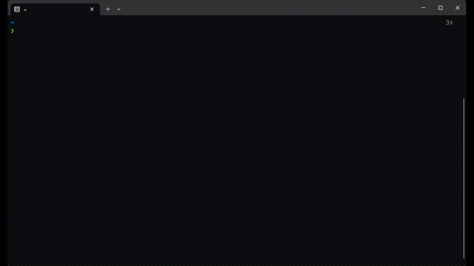

**简易的命令行 bilibili 视频下载工具**



```sh
Usage: bili-dl [OPTIONS] <URL>

Arguments:
  <URL>  视频链接

Options:
  -c, --cookies <COOKIES>  cookies.txt 的路径
  -d, --dl-dir <DL_DIR>    下载目录，默认为当前目录
  -h, --help               Print help
  -V, --version            Print version
```

支持下载普通视频、部分番剧。会员内容需要传入 Cookie

`cookies.txt` 示例:
```txt
SESSDATA=XXX; .bilibili.com
```
